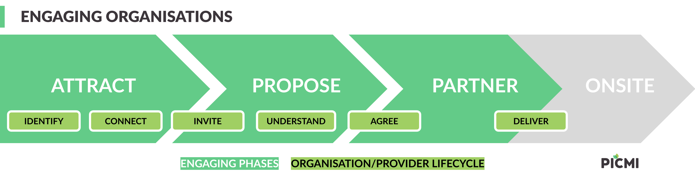

# Engaging organisations

Engaging organisations through services is a balance between a commercial process and an organisation's operating
context: the **services proposals pipeline** and the **organisation/provider lifecycle**. Successful service engagement helps both parties
understand the work, confirm capability, agree responsibilities, and move into delivery with the right information in
place.

::: prompt
This page is specific to engaging organisations for services compared with
a [general approach to opportunities](opportunity-engagement.md) and the employment-focused
[Recruiting people](recruiting-people.md) model.
:::

 

<i>Three-stage model of service engagements</i>

 

PICMI helps services engagement by breaking the process into clear stages. Instead of treating a services agreement as a
single document to complete at the end, PICMI lets organisations collect the right details, review requirements, and
confirm agreement through a structured workflow.

For services, the participant may be a grower, host, provider, contractor, employer, or another organisation. The same
model works when one organisation is requesting services and another organisation is supplying them.

:::: explanation

## Services Pipeline

PICMI views engaging organisations as three primary phases before active service delivery: _Attract_, _Propose_, _Partner_ and
_Deliver_. PICMI focuses on streamlining the propose step and how it connects with the work that happens before and
after.

### Attract

This is about finding and selecting the right organisations to work with. A service opportunity may start through an
existing relationship, industry network, direct invite, seasonal planning process, or a formal proposal.

PICMI does not force a single sourcing method. Organisations can use the channels that already work for their industry,
then use PICMI once they need a structured way to capture information, compare requirements, and move toward agreement.

### Propose

This is where PICMI is strongest. The engage phase turns an informal service need into a structured participation
process.

During engagement, organisations can:

- explain the service being requested or offered
- collect operational details such as sites, blocks, service types, timing, and contacts
- gather compliance information such as certifications, declarations, policies, and documents
- review provider capability and service requirements before agreement
- issue or complete a services agreement once the required criteria are met

The goal is to reduce ambiguity. Each party should understand what is being provided, where it will happen, who is
responsible, and what conditions apply before service delivery begins.

### Partner

This is the phase where the agreed service moves toward operational delivery. PICMI does not replace the systems used to
manage day-to-day work, scheduling, supervision, invoicing, or delivery reporting.

Instead, PICMI provides the agreed engagement record: the service details, declarations, documents, workflow responses,
and signed agreement that other operational processes can rely on.

### Onsite

This is the phase where the agreed service is in operational delivery. 
::::

:::: explanation

## Organisation/Provider lifecycle

The organisation lifecycle describes how two or more organisations move from initial contact to an agreed service
engagement. The stages are similar to recruiting people, but the focus is on organisational fit, capability,
responsibility, and service scope.

### Identify

Identify the organisations that may participate in the service engagement. This may include growers, hosts, providers,
contractors, employers, subcontractors, or programme partners.

Accurate organisation details matter because they flow into workflows, agreements, reporting, and compliance records.

### Connect

Share enough information for each organisation to understand the opportunity and decide whether to continue. This may
include service expectations, location details, seasonal timing, operational constraints, and the process for completing
requirements.

Good engagement reduces back-and-forth by making the service context clear before detailed agreement work begins.

### Invite

Invite the relevant organisation to complete the service workflow. This can be direct and targeted when the relationship
is known, or part of a broader intake process when multiple organisations may be considered.

The invite gives the organisation a clear next step and connects them to the information they need to provide.

### Understand

Both parties use the workflow to clarify fit and responsibilities. This may include confirming site details, services
required, certifications, pay or charge structures, health and safety documents, subcontractor details, and other
operational requirements.

The purpose is not just data collection. It is to make sure the agreement reflects the real service arrangement.

### Agree

Once required information is complete, the parties review and sign the relevant services agreement or participation
terms. Agreement details can be built from organisation data, opportunity data, workflow responses, and any engagement
specific overrides.

The agreement should make the service scope, responsibilities, and conditions explicit before delivery starts.

### Deliver

After agreement, the organisations move into active service delivery. The PICMI record remains the source of the agreed
terms and supporting information, while operational systems and teams manage the work itself.
::::

:::: explanation

