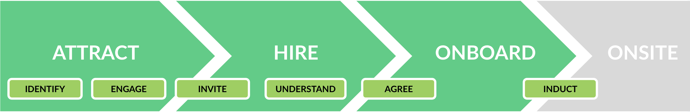

# Recruiting people

**Recruiting people** is a balance between a business process and an individual's experience: the **recruiting pipeline** and the **people lifecycle**. Successful recruiting engages people and develops their understanding. Agreements are most successful when people check their fit and opt-in to explicit criteria around the business, personal information and industry requirements. The goal is the right talent at the right time with all the right information, and at the lowest cost to everyone.

 

<i>Three-stage model of recruiting</i>

 

PICMI improves both by breaking the process into distinct stages and allowing small, independent improvements at each step. Choose how and when to engage, interview and onboard. And more importantly, at the heart of success and efficiency is to put the worker back in control to encourage engagement with and understanding from them. This requires the business to really clarify their criteria for suitability. The challenge is to take away unnecessary barriers to individuals being issued employment agreements immediately if they meet all the required criteria.

<explanation>

## Recruiting Pipeline
PICMI views recruiting people as three primary phases before they are onsite: _Attract_, _Hire_, and _Onboard_. PICMI focuses on streamlining the hiring step and how it works with adjacent steps. It helps businesses of all types, whether they rely on in-house generalists, specialists, or contractors, to streamline the entire recruiting pipeline from attracting candidates to ensuring they are onboarded and ready to work onsite effectively.
### Attract
This is about sourcing and selecting people for your workforce. The big challenge here is finding and engaging the right workers, which can be time-consuming. Since the time spent per person is relatively constant, even if the person doesn't turn up, it becomes a significant waste. A mismatch between the people and the job also adds to inefficiencies. Although PICMI doesn't handle the attract phase directly, it allows businesses to manage the attraction of candidates using their preferred methods or external tools that work well with PICMI, giving flexibility to businesses to source talent in their own way.
### Hire
In this phase, the focus is on screening and signing up people for your workforce. The main challenges are being responsive enough to secure good candidates quickly and ensuring accurate details are collected and that people understand their conditions. Common problems include incomplete documentation, compliance risks, and coordinating onboarding. Language barriers, technical literacy, and travel costs can also add to the complexity. PICMI excels in this phase with its _FastTrack Hiring_ system. It uses _Straight-through Signing_ technology quickly issuing legally binding contracts once people meet the necessary criteria. This process helps businesses secure candidates efficiently while maintaining compliance with legal requirements and reducing delays.
### Onboard
This is the phase where the workforce's data is integrated into your business systems. Common problems include errors in data entry, poor communication, and inadequate training, which can lead to confusion and unprepared workers. System setup delays and cultural disconnects can also hinder successful onboarding. Although PICMI does not handle the onboarding process itself, it ensures that all necessary data for new hires is entered into relevant systems such as payroll and HR platforms. This ensures a smoother induction experience by eliminating potential data errors or system delays as people transition into being onsite and ready to work.

</explanation>

<explanation>

## People lifecycle
The people's lifecycle is central to managing a workforce. Both the business and individuals evaluate each other throughout the process to determine if they align and agree to move forward. Below are the six key parts of the people lifecycle.
### Identify
This involves compiling the list and gathering details of the new and returning individuals for the workforce. Accurate details and profiles are compiled to ensure businesses have everything they need before engaging with potential workers.
### Engage
This phase ensures individuals have the relevant details about the role and how the process will run. Engagement also includes direct contact either through digital or manual means if required, forecasting and planning for when workers will be needed, giving both parties time to prepare.
### Invite
Direct contact is made with individuals who have been selected to extend opportunities to join the workforce. Different approaches may be used, such as automated systems or manual outreach, depending on the scale and needs.
### Understand
In this phase, both the employer and worker aim to clarify expectations through sharing information about each other. This includes understanding employment terms and legal obligations. Clear communication is critical to ensure both parties are aligned before moving forward.
### Agree
Agreement centres on finalising the contract and formalising all terms between the employer and the worker. Both sides must clearly understand and agree on the role, wages, and other conditions before signing, ensuring transparency and mutual commitment.
### Induct
Once agreements are in place, induction helps individuals transition into their roles by providing necessary training, setting up logistics such as transportation, and ensuring cultural and workplace integration is smooth.

</explanation>
