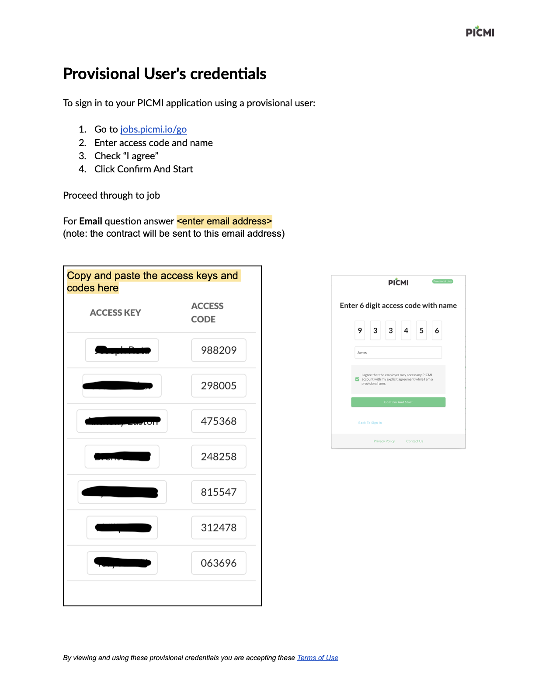

# Using Provisional Users with a shared email address

Provisional Users in PICMI provide a streamlined way for individuals to apply for jobs without needing a personal email
address or account. This is particularly useful in environments where a **shared email address** is REQUIRED — for
example, by staff assisting applicants at correctional facilities or employment hubs.

Provisional users with a shared email requires all the people completing the application to enter the shared email. All
email notifications will be sent to this email inbox.

::: prompt
Using this approach requires the business to [send instructions](#reference-instructions-to-third-patry) to the
third-party institution with access code and access keys and for the person to enter the email address into their
application.
:::

:::: explanation

## Summary Steps

1. [Understand what a provisional user is](#what-is-a-provisional-user)
2. [Set up the provisional users](./provisional-user.md#adding-provisional-users)
3. [Enable admin columns](#enabling-provisional-user-columns): customize your admin table to track provisional users
   effectively.
4. [Determine the shared email address](#shared-email-context): all provisional users enter the same monitored email
   address.
5. [Send instructions to third parties](#reference-instructions-to-third-party): share access credentials by updated and
   send instructions [see below—instructions to the third party](#reference-instructions-to-the-third-party).
6. [Guide users to sign in](#how-a-provisional-user-signs-in): use the access code and name
   at [jobs.picmi.io/go](http://jobs.picmi.io/go) to begin.
7. [Use shared email in the application](#what-email-should-be-used): all communication will go to the shared inbox.
8. Monitor that all people have correctly entered the [`Email`](#enabling-provisional-user-columns) address in the
   People page

::: prompt
See our guide to [returning workers](../guide/upcoming-season.md#summary-steps-for-returning-workers-provisional-users)
:::

::::

## What is a Provisional User?

A **Provisional User** is someone who accesses a PICMI job application using an **access code** and their **name**,
rather than a full account.

This setup is ideal when:

- Applicants do not have or cannot use personal email addresses.
- A facilitator is guiding many individuals through applications.
- Devices such as shared tablets or kiosks are used to access applications.

## Shared email context

In organisations like the correctional facilities, applicants use a **shared email** address that is not in their
control and is monitored by the institution for all communication.

PICMI supports this by:

- Routing all contracts and correspondence to that email.
- Tracking each individual’s session through unique **access codes**.
- Allowing the admin interface to show per-user details such as
    - `Access Code`
    - `Access Key`
    - `Email`

::: instructions

## Enabling Provisional User columns

To view provisional user info in your admin panel:

1. Click the **setting icon (:::icon cog:::)** above the jobseeker table.
2. In the **Customise Columns** panel, make sure these boxes are checked:
    - `Email`
    - `Provisional User`
    - `Access Key`
    - `Access Code`
    - `Access Expires`
3. Click the **Save** button.

This ensures you can monitor and manage provisional users easily.
:::

::: instructions

## How a Provisional User signs in

To start an application:

1. Go to [jobs.picmi.io/go](http://jobs.picmi.io/go)
2. Enter:
    - **Access Code**
    - **Name**
3. Check the **"I agree"** box
4. Click **Confirm And Start**

The applicant will proceed to the job application form.
:::

## What Email Should Be Used?

When asked for an email, provisional users should always enter the shared address

::: prompt
All job offers, contracts, and follow-ups will be sent here.
:::

## Reference: instructions to the third party

A sample credentials sheet for provisional users can be found here:

:::icon download::: Download
Document [pdf](/assets/Provisional-User-Credentials-Template.pdf) | <a href="/assets/Provisional-User-Credentials-Template.docx" download>
docx</a>

## Terms of use

By using a provisional user login, the applicant agrees to PICMI’s [Terms of Use](http://jobs.picmi.io/go).

