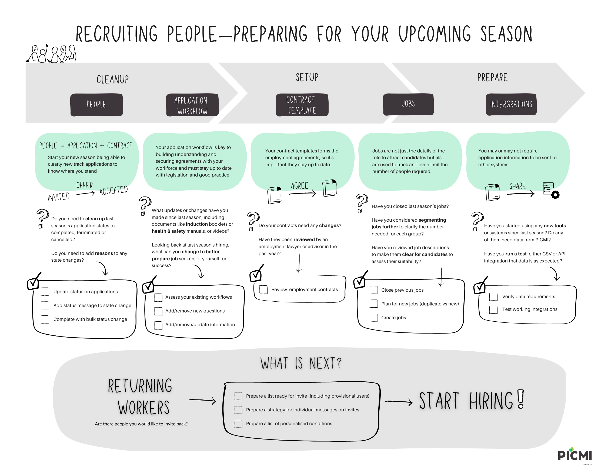

# Upcoming season—inviting returning and new workers as provisional users

To prepare for the upcoming season, you’ll need to set up and invite both new and returning workers. These workers are
typically grouped as new and existing users. This page will explain how to manage these groups by inviting them as
provisional users.

Provisional users are not sent an email invite but are instead notified and managed directly by the employer. This
approach is particularly suited to the Recognised Seasonal Employer (RSE) scheme workforce in New Zealand.

The page will also cover how to allocate workers across multiple jobs, including both new and existing workers. This is
particularly useful when sourcing a workforce from different places who arrive at different times, allowing businesses
to track groups of workers arriving for specific jobs.

{width=600px}
[Download as pdf](../../public/assets/upcoming-season.pdf)

::: prompt
**[Provisional users](provisional-user.md)** in PICMI are for workers who generally don't reliably have a unique email
address (and have agreed to have assistance)
:::

::: explanation

## Summary Steps for Returning Workers (Provisional Users)

Returning workers need to be handled slightly differently from new workers. The steps below provide an overview to
ensure both new and existing provisional users are correctly invited, tracked, and updated for the job. Follow these
steps to avoid duplicate records and ensure access codes remain valid. Note there is a [worked example below](#preparation).

1. Identify and plan the total number of workers, separating new and returning workers (e.g. 5 new and 6 existing
   workers)
2. [Create the new job](creating-a-job.md#create-job) in PICMI where both sets of workers will be invited
3. Invite the new workers by creating provisional users through
   the [create provisional user](provisional-user.md#add-a-provisional-user) process one at a time
   or [bulk creation](provisional-user.md#add-multiple-existing-provisional-users) (e.g. invite 5 new workers)
4. Invite the returning workers by using the [job's invite option](inviting-for-jobs.md#send-invites), searching for
   their [existing provisional user](inviting-for-jobs.md#search-existing-people)
   accounts (emails ending with "@noreply.picmi.io" and identifying them through their access code) and adding them to
   the new job (e.g. invite 6 existing workers)
5. [Review all provisional users](provisional-user.md#view-provisional-user-details) (new and returning) to confirm (
   or [update](provisional-user.md#update-existing-provisional-user)) that their access codes and expiry dates are
   valid for the current job period (e.g. all 11 workers)

Continue with processing and monitoring the workers:

6. [Guide users to sign in](#how-a-provisional-user-signs-in): use the access code and name
   at [jobs.picmi.io/go](http://jobs.picmi.io/go) to begin.
7. [Use shared email in the application](#what-email-should-be-used): all communication will go to the shared inbox.
8. Monitor that all people have correctly entered the [`Email`](#enabling-provisional-user-columns) address in the People page

:::

## Preparation

You've already created a job (
ideally [duplicated](https://help.picmi.io/business/article/duplicate-a-job.html#to-create-a-duplicate)), now it should
be straightforward to [invite](https://help.picmi.io/business/article/inviting-for-jobs.html) people to apply for a job.
                               
::: prompt
Before you send out an invitation, always ensure that:

* The job and application workflow are correct.
* There are enough [vacancies](https://help.picmi.io/business/article/job-application-controls.html) available.
:::

## Planning

Identify whether the people you are inviting are **new** or **existing** workers (
use [table 1](#table-1-new-or-existing-planning-by-job)):

| **Type of Worker**                                 | **Invitation Method**                                                                         |
|----------------------------------------------------|-----------------------------------------------------------------------------------------------|
| **New workers** (not previously in the system)     | Create a provisional user. This can be done in bulk using a CSV import.                       |
| **Existing workers** (previously had applications) | Use the **Search People** functionality to invite them to avoid typing or creating duplicates |

## Inviting Existing Workers

Use [table 2](#table-2-invite-via-search) and work through each **each** job:

1. **Search for the users** associated with that job.
    * Narrow [search for existing people](https://help.picmi.io/business/article/inviting-for-jobs.html#search-existing-people)
   with `@noreply.picmi.io` and job (note find specific jobs from **last year** or all)
2. **Select and add them** to the invitation list.
3. Review the consolidated table of users to avoid mistakes before sending invites.

See [sending bulk invites](https://help.picmi.io/business/article/inviting-for-jobs.html#send-bulk-invites-from-spreadsheet-application)

## Inviting New Workers

Use [table 3](#table-3-csv-data-to-create-provisional-user-per-job) for **each** job:

1. **Use CSV data** (ie table) with the required details (name and expiry)—note: easier to
   use [clipboard](https://help.picmi.io/business/article/provisional-user.html#download-access-codes-template) in/out
   of sheets application
2. Set the **expiry** in days (default is 90 days/3 months unless otherwise specified).
3. If necessary, extend the expiry beyond 90 days to accommodate hiring timelines—probably a year 365 days!
4. **Upload the CSV file** to bulk-create provisional users.

Below, we have created four separate tables (Tables 3-6), one for each of the jobs, to help structure the process
effectively. Also, those with one or two people per job can be just as
easily [added as a single provisional user](https://help.picmi.io/business/article/provisional-user.html#add-a-provisional-user)
with the name copy and pasted.

See [import multiple provisional users](https://help.picmi.io/business/article/provisional-user.html#import-multiple-provisional-users)

:::: instructions
## Table 1: new or existing planning by job

You will have already worked out how many jobs you need (this example has three)
   
::: prompt
* Harvest Workers Vanuatu 2025
* Harvest Workers PNG 2025
* Kiribati Crew 2025
:::

1. Enter all the names
2. Allocate to a job
3. Work out whether existing or new in PICMI

| **Name** | **Job**                      | **Create Provisioner User** | **Invite Existing** |
|----------|------------------------------|:---------------------------:|:-------------------:|
| XX       | Harvest Workers Vanuatu 2025 |              X              |                     |
| XX       | Harvest Workers Vanuatu 2025 |              X              |          X          |
| XX       | Harvest Workers Vanuatu 2025 |              X              |                     |
| XX       | Harvest Workers PNG 2025     |                             |          X          |
| XX       | Kiribati Crew 2025           |                             |          X          |
| XX       | Harvest Workers PNG 2025     |                             |          X          |
| XX       | Kiribati Crew 2025           |              X              |          X          |
| XX       | Kiribati Crew 2025           |                             |          X          |
| XX       | Kiribati Crew 2025           |              X              |                     |
::::  

:::: instructions
## Table 2: invite via search

Create a table of all the worker by job who are existing

| Name | Job                          |
|------|------------------------------|
| XX   | Harvest Workers Vanuatu 2025 |
| XX   | Harvest Workers Vanuatu 2025 |
| XX   | Kiribati Crew 2025           |
| XX   | Harvest Workers PNG 2025     |
| XX   | Kiribati Crew 2025           |
::::  

:::: instructions
## Table 3: csv data to create provisional user per job

Each job will have a CSV data file to be imported. In practice, if there is one or two,
just [add provisional](provisional-user.md#add-a-provisional-user) user without import.

### Harvest Workers Vanuatu 2025

| **Name** | **Expiry** |
|----------|:----------:|
| XX       |    365     |
| XX       |    365     |
| XX       |    365     |
| XX       |    365     |
| XX       |    365     |
| XX       |    365     |

### Harvest Workers PNG 2025

| **Name** | **Expiry** |
|----------|:----------:|
| XX       |    365     |

### Kiribati Crew 2025

| **Name** | **Expiry** |
|----------|:----------:|
| XX       |    365     |
::::  
