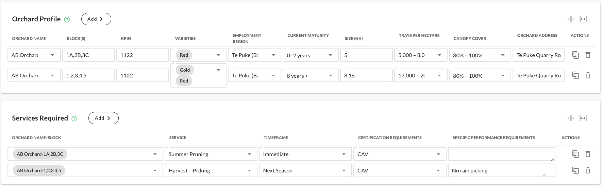
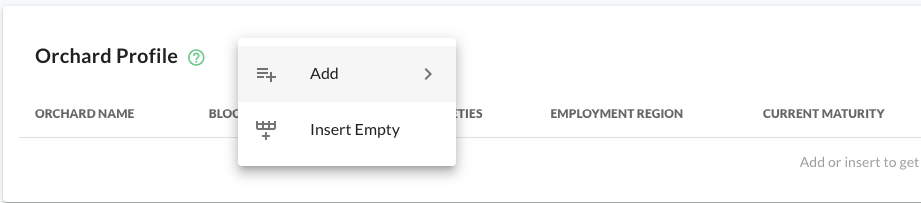
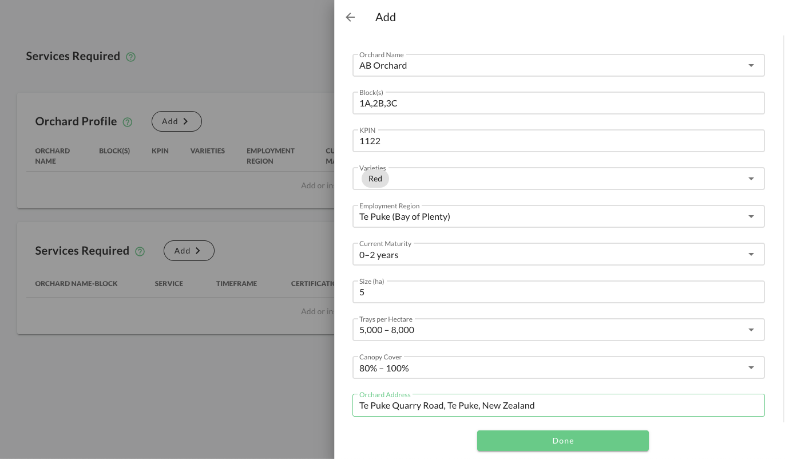
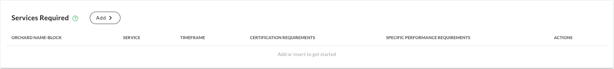
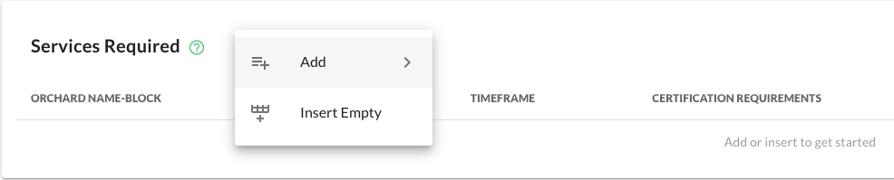
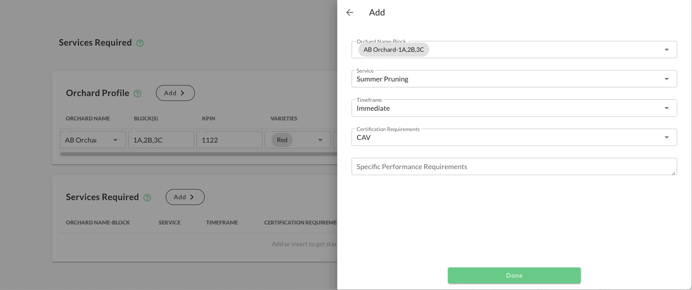
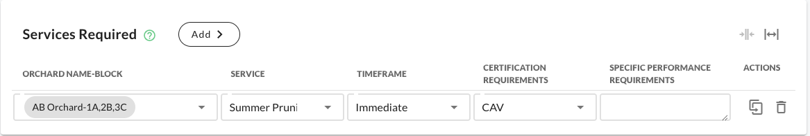
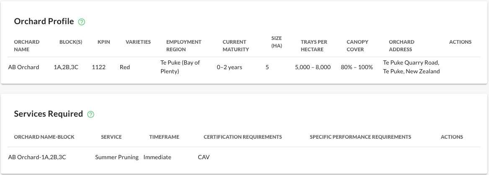

# Kiwifruit: Orchard Profile Information and Services Required

This section outlines how to record the layout, key details, and service needs of your orchard. Completing this
information accurately helps ensure **better workforce planning**, **efficient service delivery**, and **compliance
alignment** for both growers and contractors.

:::prompt
Much of this information is already in Canopy and can be copied from the Spray Diary Block Information. Ensure that you
have the latest information before starting.
:::

## Overview

The **Orchard Profile** and **Services Required** sections work together:

- **Orchard Profile** captures information about your orchard — blocks, varieties, size, and maturity.
- **Services Required** links specific orchard blocks (specified in orchard profile) to the **type of work** you need
  performed and the **timeframe** it’s required.

This ensures that the right services, people, and certifications are matched to each site.

**Completed tables**

## 1. Orchard Profile

### Purpose

The **Orchard Profile** defines the physical and operational characteristics of your orchard. It provides context for
service planning, contract preparation, and regional labour forecasting.

| Field                 | Description                                                         | Example                          |
|-----------------------|---------------------------------------------------------------------|----------------------------------|
| **Orchard Name**      | The official orchard name used for documentation and contracts.     | Te Puke Orchards Ltd             |
| **Block(s)**          | Identifiers for blocks within the orchard. Use commas for multiple. | A1, A2, B3                       |
| **KPIN**              | Numeric identifier (1–4 digits) used for validation and compliance. | 1122                             |
| **Varieties**         | Kiwifruit varieties grown on the orchard. Multiple can be selected. | Gold, Red                        |
| **Employment Region** | Where the work takes place — supports logistics and compliance.     | Te Puke (Bay of Plenty)          |
| **Current Maturity**  | Typical vine age range for the block(s).                            | 0–2 years                        |
| **Size (ha)**         | Total orchard area in hectares.                                     | 8.16                             |
| **Trays per Hectare** | Typical yield per hectare — helps estimate resourcing.              | 17,000 – 20,000                  |
| **Canopy Cover**      | Average canopy coverage across the block(s).                        | 80% – 100%                       |
| **Orchard Address**   | Physical address of the orchard for compliance and navigation.      | Te Puke Quarry Road, Te Puke, NZ |

:::prompt
You don’t need to know every figure perfectly — **start with your best available data** and refine later.
:::

### How to Add an Orchard Profile

1. Click **Add** under the *Orchard Profile* section.
2. Fill in all required fields:
    - Select **Orchard Name** or add a new one.
    - Enter **Block(s)** separated by commas.
    - Input your **KPIN** (up to four digits).
    - Choose **Varieties** (Gold, Green, or Red).
    - Select your **Employment Region** (e.g. Te Puke, Gisborne, Nelson).
    - Choose the **Current Maturity** range.
    - Enter **Size (ha)**.
    - Select **Trays per Hectare**.
    - Choose **Canopy Cover** range.
    - Enter the **Orchard Address**.
3. Click **Done** to save your orchard profile.

Once saved, your orchard blocks will appear in a table and can be linked to specific services.

### Example: Completed Orchard Profile

| Orchard Name | Block(s)   | KPIN | Varieties | Employment Region       | Current Maturity | Size (ha) | Trays per Hectare | Canopy Cover | Orchard Address                  |
|--------------|------------|------|-----------|-------------------------|------------------|-----------|-------------------|--------------|----------------------------------|
| AB Orchard   | 1A, 2B, 3C | 1122 | Red       | Te Puke (Bay of Plenty) | 0–2 years        | 5         | 5,000 – 8,000     | 80% – 100%   | Te Puke Quarry Road, Te Puke, NZ |
| AB Orchard   | 1,2,3,4,5  | 1122 | Gold, Red | Te Puke (Bay of Plenty) | 8 years +        | 8.16      | 17,000 – 20,000   | 80% – 100%   | Te Puke Quarry Road, Te Puke, NZ |

## 2. Services Required

### Purpose

The **Services Required** section links your orchard and blocks to specific types of work, required timing, and
compliance conditions. This ensures service providers understand exactly **what**, **where**, and **when** work needs to
be done.

| Field                                 | Description                                                        | Example             |
|---------------------------------------|--------------------------------------------------------------------|---------------------|
| **Orchard Name–Block**                | Links service requests to the orchard and block(s) defined above.  | AB Orchard–1A,2B,3C |
| **Service**                           | The type of work required. Select from the list or enter your own. | Summer Pruning      |
| **Timeframe**                         | When the service should start.                                     | Immediate           |
| **Certification Requirements**        | Certifications required to perform the work.                       | CAV                 |
| **Specific Performance Requirements** | Additional notes on targets, safety, or equipment.                 |                     |

:::prompt
Be as specific as possible in **Service**, **Timeframe**, and **Performance Requirements** — this helps contractors and
teams plan resources accurately.
:::

### How to Add a Service

1. Click **Add** under the *Services Required* section.
2. Complete each field:
    - Choose **Orchard Name–Block** (these come from your Orchard Profile table).
    - Select or type a **Service** (e.g. Summer Pruning, Harvest – Picking).
    - Choose a **Timeframe** (e.g. Immediate, Next Season).
    - Add any required **Certifications** (e.g. CAV, GAP).
    - Optionally, include **Specific Performance Requirements** (e.g. “No rain picking”, “All gold picked hourly”).
3. Click **Done** to save your service entry.

### Example: Completed Services Table

| Orchard Name–Block   | Service           | Timeframe   | Certification Requirements | Specific Performance Requirements |
|----------------------|-------------------|-------------|----------------------------|-----------------------------------|
| AB Orchard–1A,2B,3C  | Summer Pruning    | Immediate   | CAV                        | –                                 |
| AB Orchard–1,2,3,4,5 | Harvest – Picking | Next Season | CAV                        | No rain picking                   |

### Step 3. Validate and Review

Before finalising, double-check:

- Each **Orchard Profile** entry has complete details.
- Each **Service Required** links to an existing Orchard–Block.
- Certification and timing requirements align with the season plan.

If something doesn’t look right:

- Adjust each of fields as needed.
- Click **Done** to save.

:::prompt
Filling out the tables is easy — **getting the facts right** is the real value. Try and confirm accuracy using
previewing.
:::

:::: explanation

## Worked Example – Full Flow

1. **Add Orchard Profile**
    - Orchard Name: `AB Orchard`
    - Blocks: `1A,2B,3C`
    - KPIN: `1122`
    - Varieties: `Red`
    - Employment Region: `Te Puke (Bay of Plenty)`
    - Current Maturity: `0–2 years`
    - Size (ha): `5`
    - Trays per Hectare: `5,000 – 8,000`
    - Canopy Cover: `80% – 100%`
    - Orchard Address: `Te Puke Quarry Road, Te Puke, NZ`

**Empty table**

**Add row**

**Enter details**

**Completed row**

2. **Add Services Required**
    - Orchard Name–Block: `AB Orchard–1A,2B,3C`
    - Service: `Summer Pruning`
    - Timeframe: `Immediate`
    - Certification Requirements: `CAV`
    - Specific Performance Requirements: `None`

**Empty table**

**Add row**

**Enter details**

**Completed row**

3. **Result**
    - The orchard appears in the *Orchard Profile* table.
    - The linked service appears in *Services Required*.
    - Contractors can plan accordingly, and jobs referencing this orchard will automatically inherit its details.

**Completed tables**

::::

## Tips & Best Practices

✅ **Keep your orchard profile current.** Update it before the new season begins.  
✅ **Use consistent naming** for blocks to avoid duplicate records.  
✅ **Check certification requirements** before publishing services.   
✅ **Review before previewing** — check the Edit/Preview toggle to confirm accuracy.

## General troubleshooting

<button @click="toggleExpandAll">{{ expandAll ? 'Collapse All' : 'Expand All' }}</button>

::::faq Why isn’t my orchard showing in the “Services Required” dropdown?
This usually means the **Orchard Profile** hasn’t been saved yet.

To fix:

1. Go to the **Orchard Profile** section.
2. Check that all required fields (like Orchard Name and Region) are complete.
3. Click **Done** to save.

Once saved, your orchard and block combinations will appear in the “Orchard Name–Block” dropdown.
:::prompt
You must have at least one valid Orchard Profile before adding services.
:::
::::

::::faq Why are some orchard blocks missing or not appearing correctly?
This happens when block names are entered with extra spaces or inconsistent formatting.

To fix:

- Enter block names separated by commas **without spaces**.  
  Example:  
  ✅ `1A,2B,3C`  
  ❌ `1A, 2B, 3C`

:::prompt
PICMI treats each block code exactly as entered. Extra spaces or mismatched punctuation can cause blocks not to link
properly.
:::
::::

::::faq Why can’t I save my orchard or service entry?
One or more **required fields** are missing.

To fix:

1. Review all fields in your form.
2. Ensure all *required* fields (marked with asterisks or placeholders) are filled.
3. Click **Done** again.

:::prompt
If the form still doesn’t save, check for validation rules — e.g. the **KPIN** must be numeric and up to 4 digits.
:::
::::

::::faq Why is the timeframe or service schedule wrong?
An incorrect **Timeframe** may have been selected during entry.

To fix:

1. Click **Edit** beside the affected service entry.
2. Select the correct **Timeframe** (e.g. “Immediate”, “Next Season”).
3. Click **Done** to confirm the update.

:::explanation
Timeframes help your contractor plan labour and scheduling. It’s important to keep these accurate for reliable service
delivery.
:::
::::

