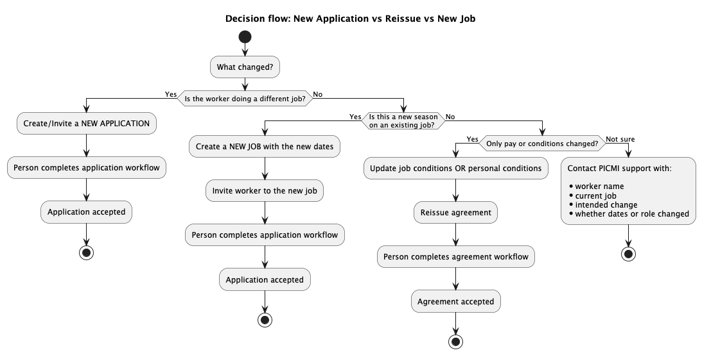

# Understanding Jobs, Roles, Contracts, and Applications in PICMI

When using PICMI, some terms mean something slightly different from everyday workplace language.

For example, someone might say **"change their role"** or **"put them on another contract"**, but PICMI needs to know
whether this means:

- a **new job**
- a **change in pay or conditions**
- or simply **updating an agreement**

::: prompt
This guide explains PICMI terms and the correct action to take.
:::

## Terminology Translation Table (Core Reference)

Use this table to translate common workplace language into PICMI concepts.

| **What you might mean**    | **Words often used**                              | **PICMI term**                     | **What it means in PICMI**                                                                                  | **Example**                 |
|----------------------------|---------------------------------------------------|------------------------------------|-------------------------------------------------------------------------------------------------------------|-----------------------------|
| Type of work someone does  | Role, Position, Contract                          | **Job**                            | A defined job type in PICMI with its own defaults (conditions) including workflow with contract template    | Packer, Packer              |
| A person's record/profile  | Employee record, Staff profile, Worker, Jobseeker | **Person** or **Worker**           | The person's profile in PICMI; can have multiple applications over time                                     | Maria Smith                 |
| Starting someone in a job  | Hire, Onboard, Sign up                            | **Application (accepted)**         | The worker accepts a specific job; this creates the active employment arrangement for that job              | Maria accepts Packer        |
| The legal paperwork        | Contract, Agreement, Employment Agreement         | **Contract**                       | The legal agreement document generated from an accepted application                                         | Casual employment agreement |
| Moving to different work   | Role change, New role                             | **New job → New application**      | If the job changes, PICMI treats it as a new employment arrangement                                         | Picker → Packer             |
| Default pay for the work   | Rate for the role                                 | **Job's Pay Rate**                 | Default pay/terms for anyone doing that job                                                                 | Packers $24/hr              |
| Special pay for one person | Different rate                                    | **Personal conditions → Pay Rate** | Overrides job defaults for a specific person's application                                                  | Sarah $26/hr on same job    |
| Changing terms (same work) | Update contract, change rates, update pay         | **Reissue application**            | Regenerate the contract (employment agreement) for the same job/application after changing conditions/dates | Pay rise, date update       |
| Work period                | Contract dates                                    | **Application dates**              | Start/end dates attached to the application (either via job or personal overrides)                          | 1 Mar – 30 Jun              |

## How PICMI Organises Employment

PICMI uses a simple structure:

**Person → Applications → Jobs**

A person can have multiple applications over time (e.g., seasonal roles), and each application is tied to a job.

Example timeline:

- Maria accepts **Picker** (Jan–Feb)
- Maria accepts **Packer** (Feb–Apr)
- Maria accepts **Grader** (May–Jun)

## When Do You Need a New Application?

A **new application is required** when the **job changes**.

Typical examples:

- Picker → Packer
- Orchard work → Supervisor
- Any change that represents a different type of work arrangement (as set up in your PICMI jobs)

**Rule of thumb:** If you describe it as "they're doing a different job now", it's a **new job → new application**.

## When Can You Just Update and Reissue the Agreement?

You usually **do not need a new application** if the worker is still doing the **same job**, but their **conditions
change**.

Common examples:

- Pay rate changes
- Date changes (start/end)
- Minor condition changes

In this case:

1. Update the job conditions (for everyone) **or** personal conditions (for one worker)
2. **Reissue the application**

::: explanation

## Pay Rates in PICMI

Pay rates can be set in two places:

### 1) Job start and end dates (default for the job)

Use this when most workers in the job share the same rate.

Example:

- All Packers = $30/hr

### 2) Personal conditions (override for an individual)

Use this when one worker needs different conditions from the job default.

Example:

- Packers default = $30/hr
- Sarah (Packer) = $32/hr via personal conditions

:::

## Jobs Are Bound to Date Ranges

In PICMI, **jobs are tied to a specific date range**.  
Even if the **type of work is the same**, each work period is treated as a **separate job**.

This is important because PICMI tracks:

- employment agreements
- worker applications
- reporting
- seasonal work periods

against the **specific job and its dates**.

Because of this, a worker **cannot apply to the same job twice once their application is complete**.

Instead, a **new job must be created for the new work period**.

## Example: Seasonal Work

Many packhouses repeat the **same type of work each year**, but each season is still a **new job period** in PICMI.

Example:

| Worker         | Job    | Dates       |
|----------------|--------|-------------|
| John Callagher | Packer | 2024 Season |
| John Callagher | Packer | 2025 Season |

Even though John is doing **the same activity (packing)**, these are **two separate jobs** in PICMI because they occur
in **different date ranges**.

## Why PICMI Works This Way

PICMI separates jobs by date range so that it can correctly track:

- which agreement applied at that time
- seasonal employment periods
- historical reporting
- compliance records
- pay and conditions at the time of employment

This ensures each work period has a **clear employment record**.

## Recommended Practice

Most customers create a **new job each season** and include the **date or season in the job name**.

Example job names:

| Job Name                      |
|-------------------------------|
| Avocado Packer – 2025 Season  |
| Avocado Packer – Mar–Jun 2025 |
| Kiwifruit Packer – 2025       |

This makes it easier to:

- track historical work
- avoid duplicate application errors
- manage seasonal employment.

## How to Start a New Work Period

If workers are returning to do the **same job again**, the easiest approach is:

1. **Duplicate the existing job**
2. Update the **job date range**
3. Update the **job name (optional but recommended)**
4. Issue **new invitations** for that job

This creates a **new job period** while keeping the same conditions and setup.

## Common Error: "User application is already complete"

You may see this message when inviting a worker to a job they have already completed.

Example scenario:

- Worker previously worked on **Packer – 2024 Season**
- Their application is marked **complete**
- You attempt to invite them again to the **same job**

PICMI prevents this because **applications cannot be duplicated on the same job once completed**.

### How to fix it

Create a **new job with the new date range**, then invite the worker to that job.

## Quick Summary

| Scenario                                                                | What to do in PICMI                                                     |
|-------------------------------------------------------------------------|-------------------------------------------------------------------------|
| Worker changes to a different job                                       | **Create/accept a new application**                                     |
| Worker returns to the same type of work in a new season or date range   | **Create a new job with the new dates, then invite them to that job**   |
| Worker stays in the same job but rate changes                           | **Update conditions and reissue the agreement**                         |
| Rate changes for everyone in that job                                   | **Update the job conditions and reissue agreements as needed**          |
| Rate changes for one worker only                                        | **Update personal conditions and reissue the agreement**                |
| Worker cannot be invited because "user application is already complete" | **Create a new job for the new date range and invite them to that job** |

## Decision-making process

## FAQs

<button @click="toggleExpandAll">{{ expandAll ? 'Collapse All' : 'Expand All' }}</button>

::: faq If someone changes roles, what does PICMI need to know?
Whether it's a **different job** (new application) or the **same job** with different pay or conditions (reissue
agreement).
:::

::: faq Why does a new job require a new application?
Because PICMI treats each **job as a separate employment arrangement**.  
When a worker accepts a job, PICMI generates an **employment agreement** based on that job's conditions.  
If the job changes, a **new application and new agreement** are required.
:::

::: faq What does contrac mean in PICMI?
In everyday language, people often say **"contract"** when they mean the type of work or arrangement.

In **PICMI**, a **contract** specifically refers to the **employment agreement document** generated when a worker
accepts an application.

So:

| Everyday Meaning           | PICMI Meaning                            |
|----------------------------|------------------------------------------|
| Contract = job arrangement | Contract = employment agreement document |

:::

::: faq Can anyone have multiple applications?
Yes.

A **person can have multiple applications over time**, each linked to a specific job and employment agreement.

Example:

| Worker | Job    | Dates   |
|--------|--------|---------|
| Maria  | Picker | Jan–Feb |
| Maria  | Packer | Feb–Apr |
| Maria  | Grader | May–Jun |

:::

::: faq What if someone just gets a pay rise?
If the worker is still doing the **same job**, you usually **do not need a new application**.

Instead:

1. Update the **job conditions** (for everyone), or **personal conditions** (for one worker).
2. **Reissue the employment agreement**.

### What if someone moves teams but does the same job?

If the **job itself hasn't changed**, you can normally **reissue the agreement** rather than creating a new application

### What if different workers doing the same job are paid differently?

Use **personal conditions** to override the **job conditions** for a specific worker.

Example:

| Worker | Job    | Pay    |
|--------|--------|--------|
| John   | Packer | $24 hr |
| Sarah  | Packer | $26 hr |

The job rate stays **$24/hr**, but Sarah's **personal conditions override it**.
:::

::: faq How do I decide whether to create a new application or reissue the agreement?

| Situation                                | What to do                                  |
|------------------------------------------|---------------------------------------------|
| Worker changes to a different job        | Create a **new application**                |
| Worker stays in same job but pay changes | **Update conditions and reissue agreement** |
| Pay changes for everyone doing that job  | **Update job conditions**                   |
| Pay changes for one worker only          | **Update personal conditions**              |

:::

::: faq What if I'm unsure whether to create new application or reissue?
If you're unsure which process to follow, contact **PICMI support** with:

- Person's name
- Current job
- What you want to change
- Whether the change affects **one person or the whole job**

We can guide you on the correct process.
:::

::: faq Why can't I invite a worker back to the same job?
Because their **application to that job is already complete**.  
PICMI prevents duplicate applications for the same job.

Instead, create a **new job for the new date range**.
:::

::: faq The role is the same. Why do I need a new job?
Even if the **activity is the same**, PICMI tracks employment by **job period**.

Each season or date range is treated as a **separate job** so agreements and reporting remain accurate.
:::

::: faq What is the easiest way to create the new job?
Use the **Duplicate Job** feature.

This copies:

- job conditions
- agreement templates
- settings

You only need to update the **dates and job name**.
:::

::: faq Do I need new agreements for returning workers?
Yes.

When a worker accepts a **new job application**, PICMI generates a **new employment agreement** for that work period.
:::

::: faq Should I include dates in job names?
Yes, this is recommended.

Adding dates or seasons helps distinguish jobs and avoid confusion.

Example:

- Packer – 2024 Season
- Packer – 2025 Season
  :::

::: faq Can a worker have multiple applications?
Yes.

Workers commonly have **multiple applications over time**, especially for seasonal work.

Example:

| Worker | Job           | Dates   |
|--------|---------------|---------|
| John   | Packer – 2024 | Jan–Mar |
| John   | Packer – 2025 | Jan–Mar |

Each application represents a **separate employment period**.
:::

