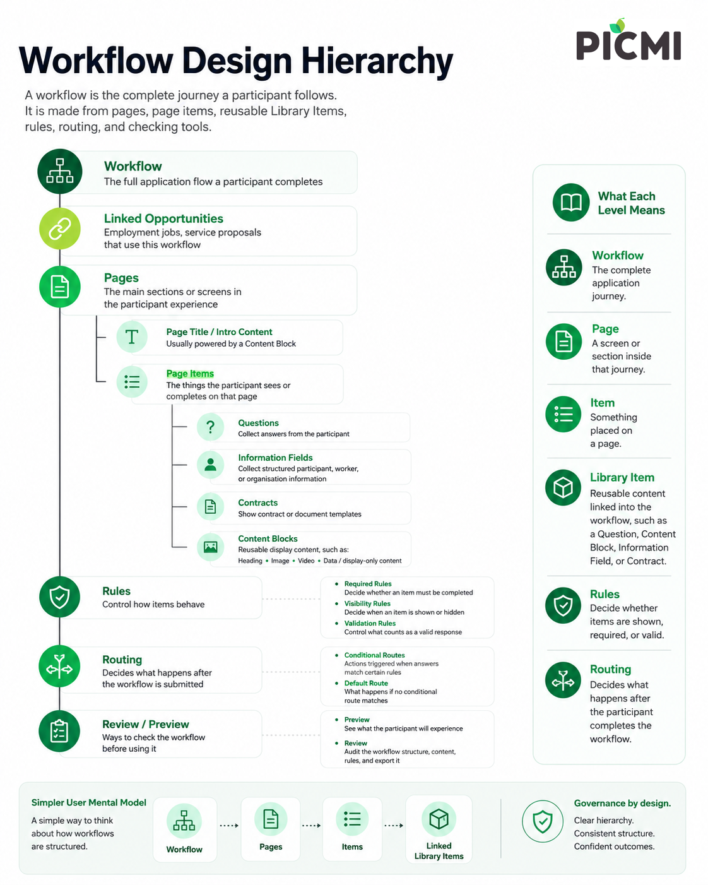

# Using the Workflow Builder

The Workflow Builder is where you manage workflow structure, preview the participant experience, and review workflow
contents.

## Open the Workflow Builder

::: instructions

1. Go to **Setup** > **Workflows**.
2. Locate the workflow row, click &vellip; (vertical dots) to open the menu.
3. Choose **Preview**, **Edit**, or **Review** mode.

:::

## Builder modes

| Mode        | Use it to                                                                                            |
|-------------|------------------------------------------------------------------------------------------------------|
| **Preview** | Check the participant experience across desktop, tablet, and mobile frame sizes                      |
| **Edit**    | Change workflow pages, item placement, Library Items, required state, visibility, and linked details |
| **Review**  | Audit workflow contents in a searchable table and export the review data                             |

::: prompt
**Review mode** is a builder mode for auditing contents. A routing **Review outcome** means a participant answer needs
human review before the workflow can continue.
:::

## What the builder manages

Use the builder to manage:

- pages and page order
- items on pages
- **library items** linked to the workflow
- required or optional state
- visibility conditions such as **visible when...**
- preview and review checks before using the workflow

## Library Items

Library Items are reusable cross-workflow items. They include Questions, Information, Content Blocks, and Contracts.

The workflow controls where a Library Item appears. The Library Item controls what the participant sees or what
template, field, validation, or content is reused.

## Related articles

- [Updating workflows](./updating-workflows.md)
- [Adding Library Items](./adding-library-items.md)
- [Previewing workflows](./previewing-workflows.md)
- [Reviewing and exporting workflow contents](./reviewing-workflow-contents.md)
