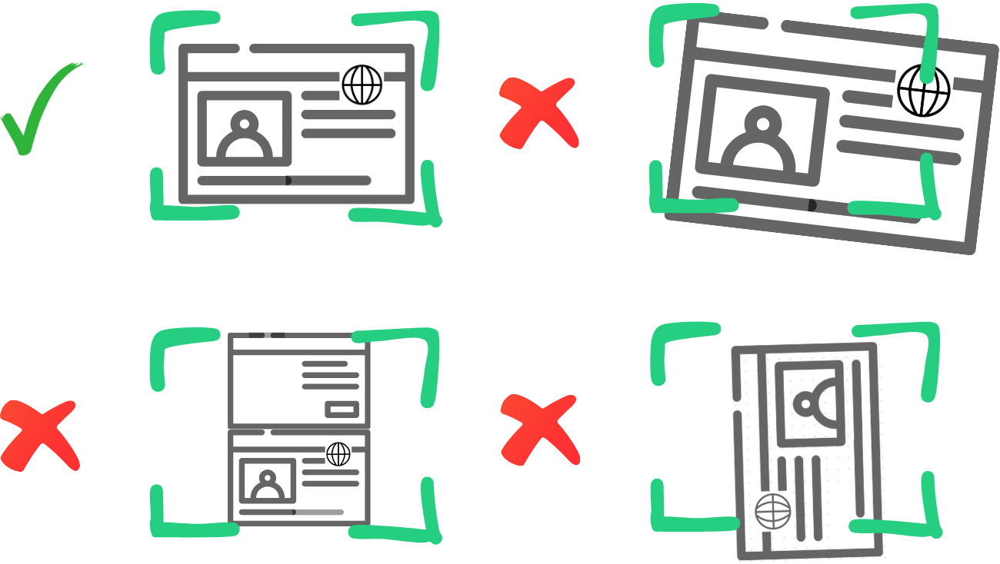
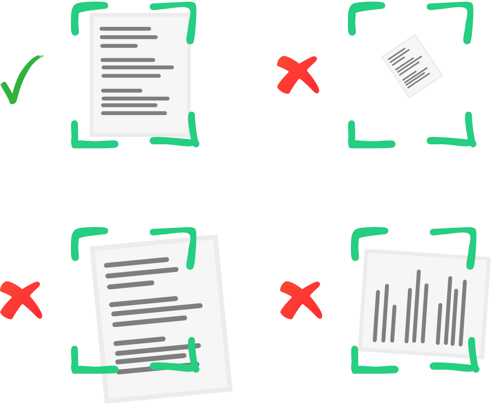

# Adding a photo

Some applications require photos. Ensure that
you [take good photos](#guidelines-for-taking-photos-of-photo-ids-with-your-phone) and
then [crop them well](#adding-a-photo).

::: prompt
A well cropped photo allows PICMI to store as little information as possible and
particularly [biometric data](#biometric-protection) to help protect you
:::

## How to Add a Photo

Your photo will appear in the photo gallery, where you can:

- See a list of all your photos
- Remove any photo
- Zoom in to get a closer look
- See more details, such as the file name and size

<instructions>

## Add Photo to Your Application

1. From your application question, click **Add Photo**
2. Now choose the photo
    * **Existing**: click on any photo that has been previously updated
    * **New**: first add a new photo and then click on the photo
        1. Click New Photo
        2. Select type ([more information](#preset-photo-sizes))
            * Photo ID
            * Passport
            * Document
        3. Resize and crop ([more information](#crop-your-photo))
        4. When done, click **Save**
3. Click **Add to Application**.

::: prompt
Once a photo has been added to a question, you can only remove that photo by adding a new photo.
:::
</instructions>

## Adding a New Photo

When you add a new photo, it's important to make sure the photo is centred and fits well. This ensures the photo is
clear and easy to use in your application. If it's not centred properly, the photo might not show well, or some parts
might get cut off.

**What needs to be showing:**  
The photo should clearly show your face or the document details, with no obstructions or too much background. Your face
should be well-lit, and the photo should not be blurry. For documents, ensure the full document is visible, with no
parts cut off.

::: prompt
Removing the outer parts of an image is called Cropping.
:::

## Preset Photo Sizes

There are three types of photos with preset sizes (width and height) to match:

- **Photo ID** :::icon card-account-details-outline::: This is for your identification photo. The needs to
  show your face clearly and to the edges of the card. You may need to take a second photo of the backside/
- **Passport** :::icon passport::: This size is for your passport photo. Take one side at a time (ie there
  are two photos). You can use the same source photo if need be and crop out one page at a time.
- **Document** :::icon cellphone-screenshot::: This is for photos of documents, where the entire document
  must be visible and readable.

These preset sizes are made to ensure that each type of photo meets the requirements for your application, keeping it
clear and professional.

## Crop your photo

You can make these changes to your photo to crop the image:

- **Zoom in/out**: Start at the default size, then zoom in or out to adjust (slider at the bottom)
- **Rotate left/right**: Turn the photo to the left :::icon rotate-left::: or
  right :::icon rotate-right:::.
- **Flip horizontally/vertically**: Flip the photo to show it from the opposite
  side :::icon flip-horizontal::: :::icon flip-vertical:::.
- **Reset** :::icon close::: clears the image to start again

<explanation>

### Passport

---

### Photo ID

---

### Passport

</explanation>

## Biometric Protection

PICMI reduces the quality of your photo just enough so it can still be seen by humans but doesn't show unnecessary
details. This protects your privacy while ensuring your photo can still be used for your application. The goal is to
balance between showing what is necessary for the application and keeping your personal information safe.

::: prompt
There is no legal requirement to store you biometric data but there are legal requirements for its protection. There is
a legal requirement of employers to prove that the person's identification has been verified as theirs. Saving a photo
is usually how they do this.
:::

## Guidelines for taking photos of Photo IDs with Your phone

Follow these tips to ensure your Photo ID pictures are clear and meet application requirements:

### Find a well-Lit area

- Use natural light if possible to avoid harsh shadows or glare.
- If indoors, make sure the lighting is even and bright but not directly reflecting on the ID.

### Use a flat surface

- Place the ID on a flat, clean surface with a plain background (preferably white or light-coloured).
- Avoid holding the ID in your hand, as this can make the image shaky or unfocused.

### Position your phone correctly

- Hold your phone directly above the ID to avoid angles or distortion.
    - The ID should fill most of the screen but leave some space around the edges.
- Keep your phone steady to avoid blurry images. Use both hands or a phone stand.

### Ensure the ID is in focus

- Tap the screen on your phone to focus on the ID.
- Check that all the details (photo, text, and numbers) are sharp and readable.

### Avoid glare and reflections

- If there’s glare from the light, adjust the angle of the ID or your phone slightly until the glare disappears.
- Turn off the flash on your phone if it creates bright spots.

### Check the image before uploading

- Make sure the entire ID is visible, including all edges.
- Double-check that the photo is not blurry and all details are clear.
- If any part of the ID is cut off, take the photo again.

### Save the photo in the correct format

- Most application systems accept JPG or PNG files. Ensure your photo is saved in one of these formats.
- Keep the photo's resolution high enough to see details clearly, but not excessively large in file size.
